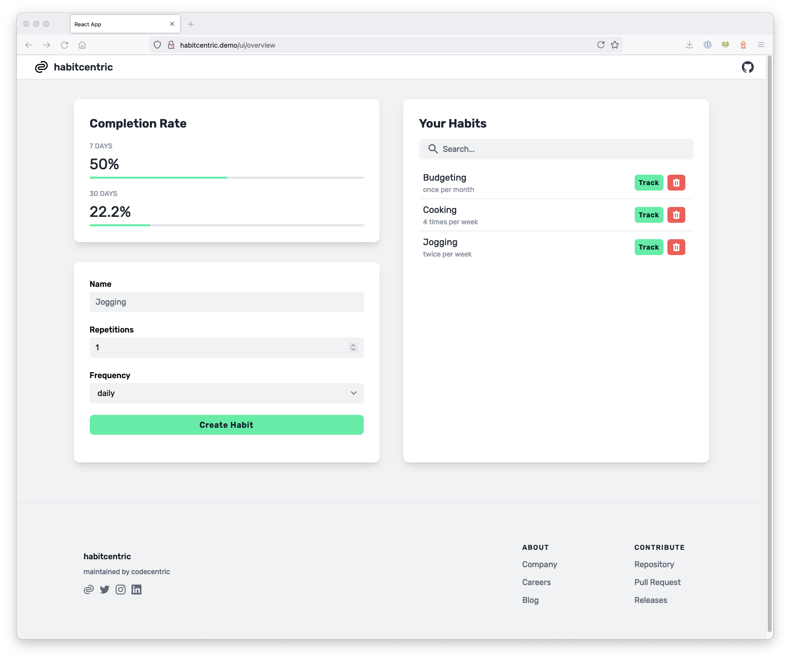
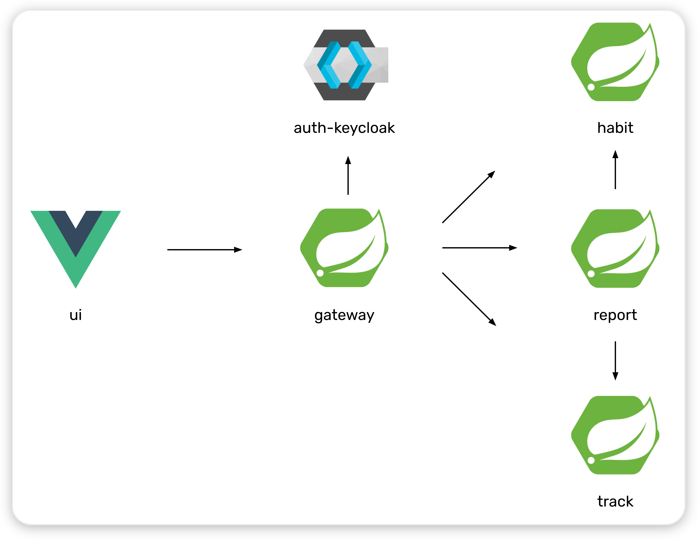

<h1 align="center" style="border-bottom: none;">🗓 🔍 ☀️ habitcentric</h1>
<h3 align="center">A microservice demo application showcasing cloud-native technologies</h3>

habitcentric is a small web application for creating and maintaining long-term positive habits.
It is used as an example for a containerized application in multiple showcases demonstrating
cloud-native technologies.



## ⭐️ Overview

Welcome to habitcentric! 👋 🎈 Before you can start learning new technologies by following the
provided showcases, let us take a look at habitcentric's components:

- [**habit**](./services/habit) - manages & persists habits with their name, repetitions and frequency
- [**track**](./services/track) - manages & persists tracked dates for habits
- [**report**](./services/report) - calculates habit tracking report based on saved habits and tracked dates
- [**gateway**](./services/gateway) - routes requests to backend services
- [**ui**](./services/ui) - delivers user interface to manage habits and tracked dates
- [**auth-keycloak**](./services/auth-keycloak) - enables OIDC authorization flows

<p align="center">
  
</p>

## 📖 Showcases

Now that you know what habitcentric is, you can start learning how to deploy habitcentric to
Kubernetes using Helm charts and Helmfile or take an even deeper dive by learning all about
service meshes and their features!

- [**Docker Compose Deployment**](./infrastructure/docker/README.md)
- [**Kubernetes Deployment**](./infrastructure/kubernetes/README.md)
- [**Istio Configuration**](./infrastructure/istio/README.md)
- [**Linkerd Configuration**](./infrastructure/linkerd/README.md)
- [**Kuma Configuration**](./infrastructure/kuma/README.md)
- [**Traefik Mesh Configuration**](./infrastructure/traefik-mesh/README.md)

### Supported infrastructure features/components per showcase

|  Feature / Environment  |        Docker Compose         |          Kubernetes           |               Istio               |              Linkerd              |               Kuma                |              Traefik              |
|:-----------------------:|:-----------------------------:|:-----------------------------:|:---------------------------------:|:---------------------------------:|:---------------------------------:|:---------------------------------:|
| API Gateway Replacement |  |  |  |  |  |  |
|          mTLS           |  |  |  |  |  |  |
|    Advanced Routing     |  |  |  |      |      |      |
|  Service Authorization  |  |  |  |      |      |      |
|   User Authorization    |  |  |  |      |      |      |
|       Resilience        |  |  |  |  |      |      |
|     Fault Injection     |  |  |  |  |      |      |
| Network / Route Metrics |  |  |  |  |  |  |
|   Distributed Tracing   |  |  |  |  |  |  |

Please note that a feature may be unsupported because of several reasons. It may be unsupported
by the used product, it may not be working for unknown reasons (i.e. Kuma mTLS) or we may
not had the time to configure it yet at all.

## 🚀 Advanced quickstart

If you don't want to go through the detailed step-by-step showcases but want to get up and running 
fast, we provide a `bootstrap.sh` script to quickly bootstrap some environments. 
It uses minikube to start a Kubernetes cluster and deploys & configures habitcentric and all
infrastructure components for you.

> ⚠️ Currently supported environments are:
>
> - Kubernetes
> - Istio
> - Linkerd

```shell
# kubernetes
./bootstrap.sh

# istio
./bootstrap.sh istio

# linkerd
./bootstrap.sh linkerd
```

The script tells you how to access the habitcentric UI after the deployment was successful.

## ⚙️ Scripted Demos

You can also find some scripted demos in the `demos` directory.
The demos interactively apply configurations step-by-step and guide you through them. They showcase
specific scenarios, like for example a chaos experiment with Istio.

## 🛠 Contributing

We ❤️ pull requests! You can view habitcentric as your personal playground for studying new
technologies and just trying them in a more sophisticated environment. If you want to hack on
habitcentric, fix issues and maybe even provide additional components, showcases or demos, you can
find more infos on how to work with this repository in our [`BUILD.md`](./BUILD.md).

## ⚠️ Known Issues

### docker & minikube with kvm2 driver

The network minikube uses for kvm2 VMs restricts routing to the guest. This prevents communication
from docker containers to the minikube VM.

When you want to use the locust load & performance testing running inside docker containers on the
host you need to apply the following workaround.

Check which bridge interface is used by the network

```shell
sudo virsh net-info minikube-net
```

```
sudo virsh net-info minikube-net
Name:           minikube-net
UUID:           b006294e-dcbd-4263-b9e0-af9cd3d88ba1
Active:         yes
Persistent:     yes
Autostart:      yes
Bridge:         virbr1
```

To take a look at the rules run `sudo iptables -vnxL FORWARD`
The rules you don't want are looking like this:

```
Chain FORWARD (policy DROP 0 packets, 0 bytes)
    pkts      bytes target     prot opt in     out     source               destination
       0        0 REJECT     all  --  *      virbr1  0.0.0.0/0            0.0.0.0/0            reject-with icmp-port-unreachable
       0        0 REJECT     all  --  virbr1 *       0.0.0.0/0            0.0.0.0/0            reject-with icmp-port-unreachable
```

To remove the rules run:

```shell
sudo iptables -D FORWARD -i virbr1 -s 0.0.0.0/0 -d 0.0.0.0/0 -j REJECT
sudo iptables -D FORWARD -o virbr1 -s 0.0.0.0/0 -d 0.0.0.0/0 -j REJECT
```

It is possible that there are multiple identical iptables rules, just run the delete commands until
iptables returns an error:
`iptables: Bad rule (does a matching rule exist in that chain?).`
